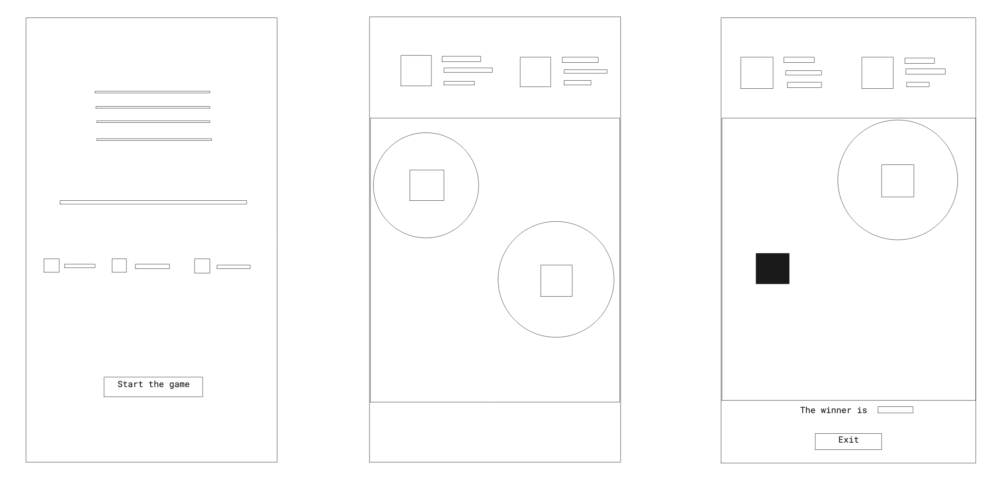
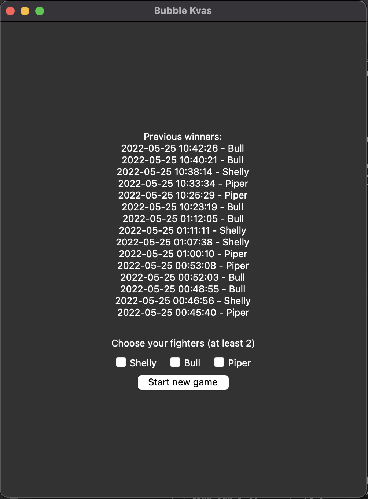
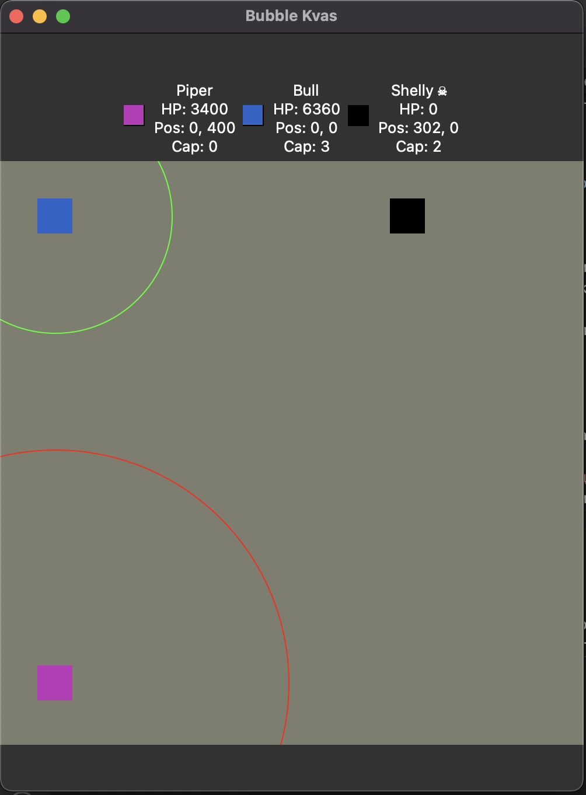
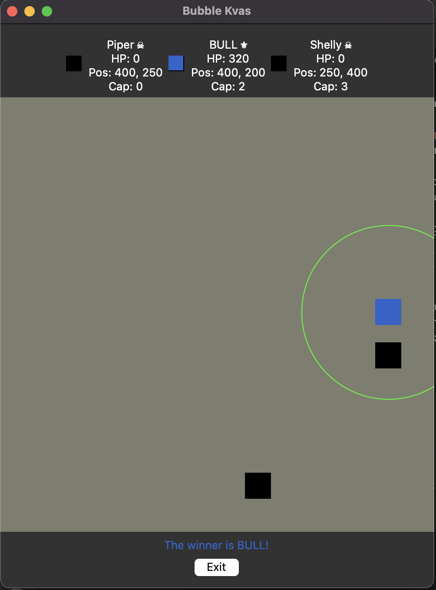

## Контрольная работа #3

Создание GUI для программы из предыдущей контрольной работы

### Цель работы:

Создать GUI, позволяющий использовать весь функционал программы, с использованием библиотеки tkinter.

#

### Задачи:

* Реализовать интерфейс для выполнения следующих задач: 
    1. Отображение предыдущих победителей на главном экране
    2. Выбор бойцов на главном экране
    3. Запуск игры
    4. Отображение игрового поля и бойцов на нем
    5. Отображение характеристик бойца - здоровья, позиции, количества зарядов, радиуса атаки
    6. Отображение атак и получения урона

#

### Ход работы:

### 1. Проектирование

Для начала нужно было понять, какие компоненты будут присутствовать в графическом окне, и как они будут взаимодействовать с "бэкендом" игры.

Было решено, что при запуске в окне будет отображаться текст со списком победителей из прошлых запусков игры, чекбоксы для выбора бойцов (нужно будет выбрать как минимум 2-х, чтобы бой состоялся), а также кнопка начала игры.

При нажатии на кнопку, окно очищается, и появляется поле - Canvas, на котором будут отрисовываться бойцы, над полем будут отображены их характеристики. Для отображения характеристик бойцов будет удобно создать отдельный класс, чтобы не переписывать одно и то же несколько раз.

При завершении игры, будет отображаться надпись о победителе, и появляться кнопка выхода из игры.

Схематичное изображение интерфейса приведено на Рис. 1.


Рис. 1. Схема интерфейса
<br>

Так как основной поток программы будет занимать главный цикл GUI, обработка событий игры должна происходить в отдельном потоке.
После выбора пользователем бойцов и нажатия на кнопку начала игры, будет запускаться отдельный поток, в котором будет происходить действие игры, и который будет изменять отображаемые в окне данные.

<br>

### 2. Написание кода

Для начала нужно создать главное окно игры, и расположить в нем виджеты.

```python
    ui = Tk()
    ui.geometry('500x650')
    ui.title('Bubble Kvas')

    frame = Frame(ui)

    ...
    
    winners_label = Label(frame, text=winners_str)
    start_game_button = Button(frame, text='Start new game', command=start_game_thread)

    shelly_var = BooleanVar()
    bull_var = BooleanVar()
    piper_var = BooleanVar()

    shelly_checkbox = Checkbutton(frame, text='Shelly', variable=shelly_var, onvalue=True)
    bull_checkbox = Checkbutton(frame, text='Bull', variable=bull_var, onvalue=True)
    piper_checkbox = Checkbutton(frame, text='Piper', variable=piper_var, onvalue=True)
    choose_fighter_label = Label(frame, text='Choose your fighters (at least 2)', pady=5)

    frame.place(relx=.5, rely=.5, anchor="center")
    winners_label.grid(column=1, row=1, columnspan=3)
    choose_fighter_label.grid(column=1, row=2, columnspan=3)
    shelly_checkbox.grid(column=1, row=3)
    bull_checkbox.grid(column=2, row=3)
    piper_checkbox.grid(column=3, row=3)
    start_game_button.grid(column=1, row=4, columnspan=3)

    ui.mainloop()

```
Фраг. 1. Отрисовка главного окна

Теперь при запуске программы появится следующее окно (Рис. 2)

Рис. 2. Главное окно

Функция start_game_thread (Фраг. 2) вызывается при нажатии на кнопку начала игры и запускает поток бэкенда игры.

```python
def start_game_thread():
    game_thread = Thread(target=play, daemon=True)
    game_thread.start()
```
Фраг. 2. Функция start_game_thread.

В функции play (Фраг. 3) создается поле для игры и игроки. Если было выбрано меньше 2-х игроков, надпись на экране мигает красным.

```python
def play():
    global winner_name
    global frame

    field = Field(400, 400)

    try:
        if piper_var.get():
            player1 = Piper(2, field)
        if bull_var.get():
            player2 = Bull(2, field)
        if shelly_var.get():
            player3 = Shelly(2, field)
    except:
        print('Can`t initialize players')
        ui.destroy()
        exit(1)

    if len(field.characters) < 2:
        choose_fighter_label.configure(foreground='red')
        sleep(0.5)
        choose_fighter_label.configure(foreground='white')
        exit(1)
```
Фраг. 3. Функция play

Если же все прошло успешно, экран очищается, и появляется поле с информацией об игроках (Фраг.4). 

```python
    winners_label.destroy()
    start_game_button.destroy()
    shelly_checkbox.destroy()
    bull_checkbox.destroy()
    piper_checkbox.destroy()
    choose_fighter_label.destroy()

    info_frame = Frame(frame)
    player_infos = []

    for i, c in enumerate(field.characters):
        player_info_frame = PlayerInfoFrame(info_frame, c)
        player_infos.append(player_info_frame)
        player_info_frame.grid(column=i, row=1)

    canvas = Canvas(frame, height=field.height + 100,       width=field.width + 100, bg='#7e7e6e')
```
Фраг. 5. Создание поля и блоков информации.

Для удобного отображения характеристик используется класс PlayerInfoFrame (Фраг. 5).

```python
class PlayerInfoFrame(Frame):
    def __init__(self, parent, player):
        super().__init__(parent)
        self.canvas = Canvas(self, height=20, width=20)
        self.canvas.create_rectangle(0, 0, 20, 20, fill=player.color, outline='black')
        self.info_var = StringVar()
        self.info_var.set(f'{player.name}\nHP: {player.health}\nPos: {player.x}, {player.y}\nCap: {int(player.capacity)}')
        self.info_label = Label(self, textvariable=self.info_var)

        self.canvas.grid(row=1, column=1)
        self.info_label.grid(row=1, column=2)
```
Фраг. 5. Класс PlayerInfoFrame.

Главный цикл игры остался фактически неизменным, за исключением добавления отрисовки событий.

Полный код можно увидеть в файле [main-ui.py](./main-ui.py)

### Работа программы

Теперь при запуске игры, после нажатия на кнопку начала игры, появляется поле и блоки информации(Рис. 3).


Рис. 3. Поле и блоки информации.

После того, как на поле остается только один игрок, появляется надпись о победителе и кнопка выхода из игры.


Рис. 4. Конец игры.

### Вывод

В процессе выполнения этой лабораторной я научился использовать библиотеку tkinter и использовать многопоточность для разделения работы GUI и бэкенда.